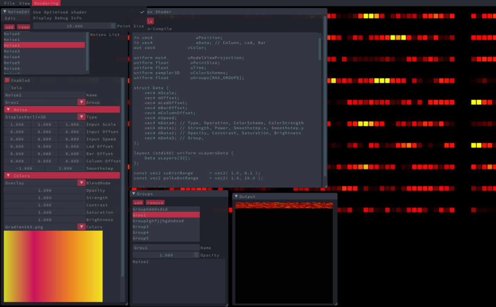
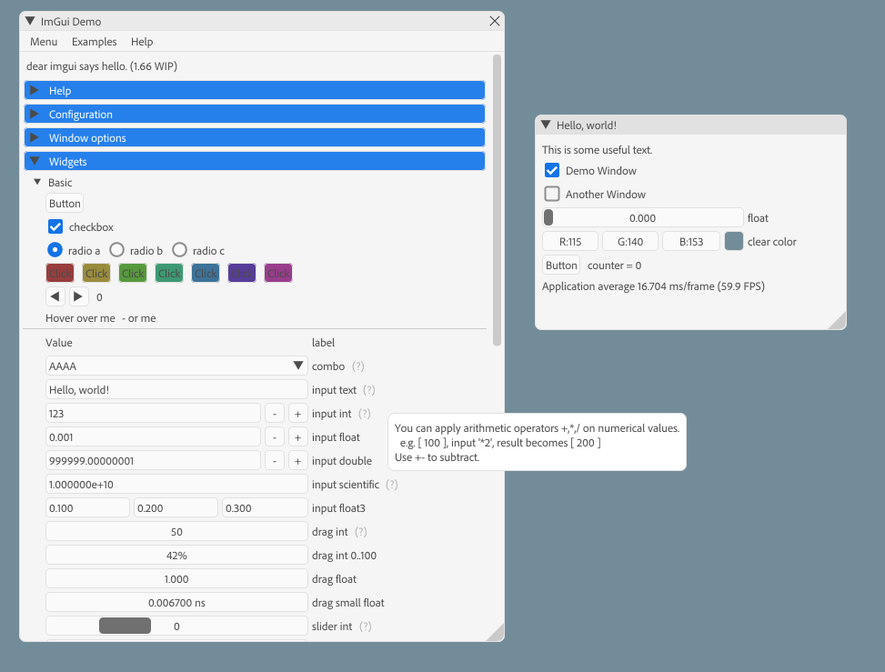
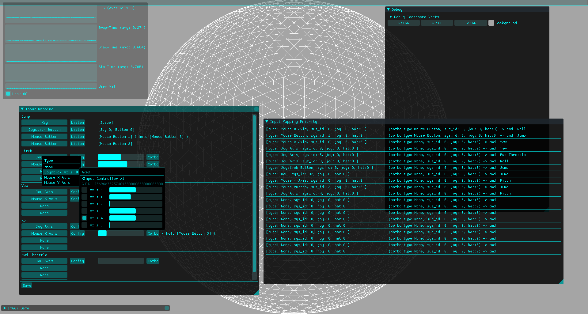
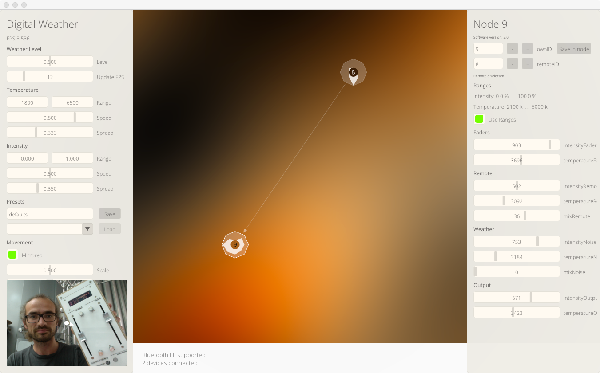
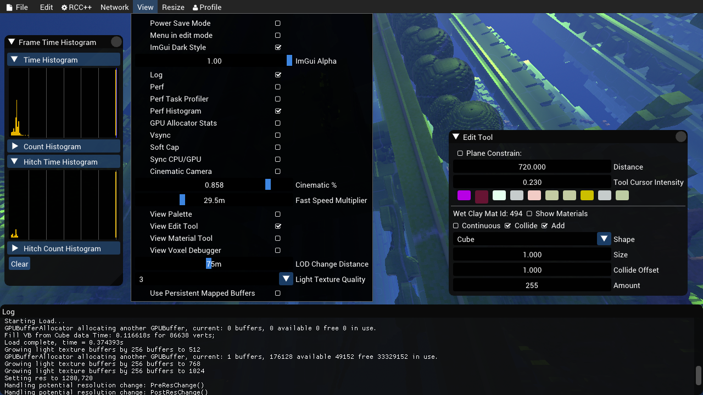
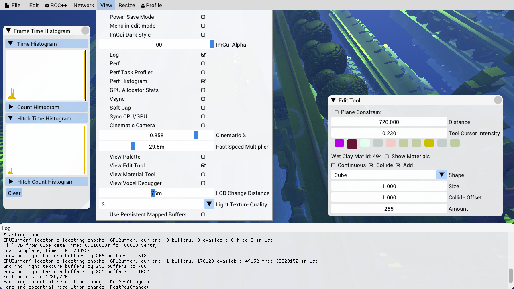
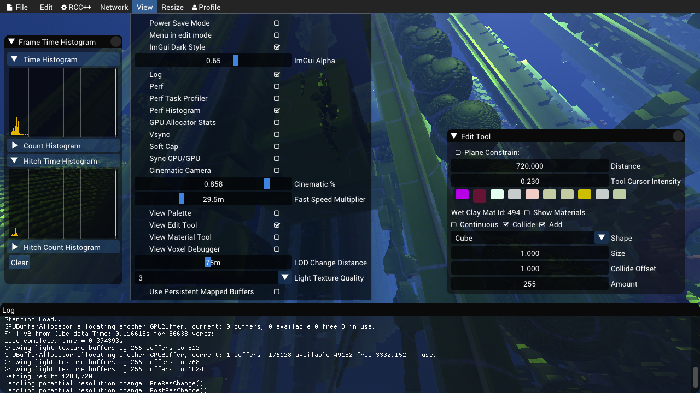
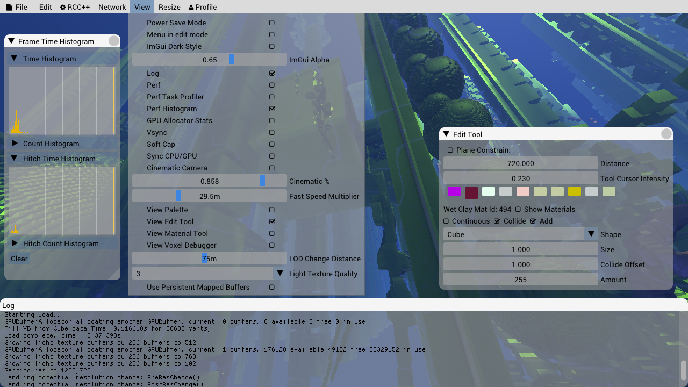
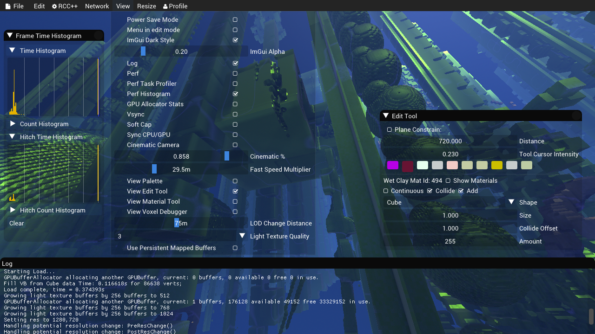
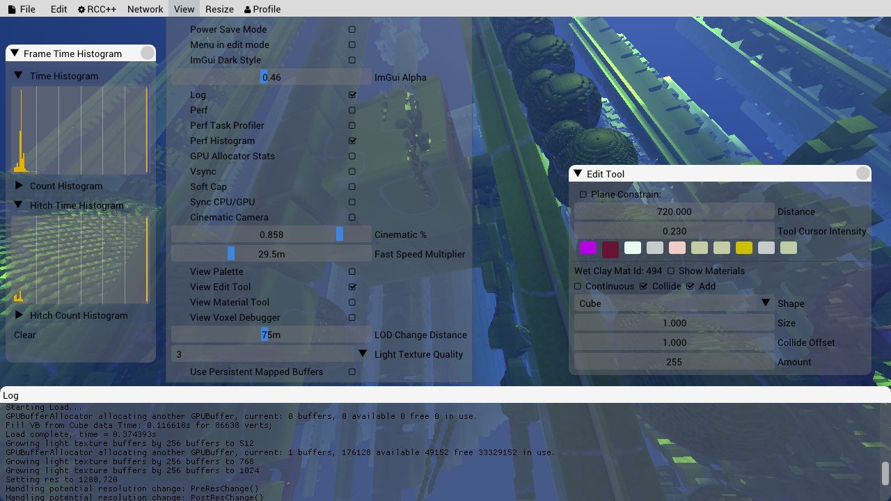

# dear-imgui-styles

This repo shall be a collection of various and amazing Dear Imgui styles

## simongeilfus/Cinder-ImGui

[simongeilfus/cinder-imgui](https://github.com/simongeilfus/Cinder-ImGui)



```c
ImGui::Options& ImGui::Options::darkTheme()
{
    mStyle.WindowMinSize        = ImVec2( 160, 20 );
    mStyle.FramePadding         = ImVec2( 4, 2 );
    mStyle.ItemSpacing          = ImVec2( 6, 2 );
    mStyle.ItemInnerSpacing     = ImVec2( 6, 4 );
    mStyle.Alpha                = 0.95f;
    mStyle.WindowRounding       = 4.0f;
    mStyle.FrameRounding        = 2.0f;
    mStyle.IndentSpacing        = 6.0f;
    mStyle.ItemInnerSpacing     = ImVec2( 2, 4 );
    mStyle.ColumnsMinSpacing    = 50.0f;
    mStyle.GrabMinSize          = 14.0f;
    mStyle.GrabRounding         = 16.0f;
    mStyle.ScrollbarSize        = 12.0f;
    mStyle.ScrollbarRounding    = 16.0f;

    ImGuiStyle& style = mStyle;
    style.Colors[ImGuiCol_Text]                  = ImVec4(0.86f, 0.93f, 0.89f, 0.78f);
    style.Colors[ImGuiCol_TextDisabled]          = ImVec4(0.86f, 0.93f, 0.89f, 0.28f);
    style.Colors[ImGuiCol_WindowBg]              = ImVec4(0.13f, 0.14f, 0.17f, 1.00f);
    style.Colors[ImGuiCol_Border]                = ImVec4(0.31f, 0.31f, 1.00f, 0.00f);
    style.Colors[ImGuiCol_BorderShadow]          = ImVec4(0.00f, 0.00f, 0.00f, 0.00f);
    style.Colors[ImGuiCol_FrameBg]               = ImVec4(0.20f, 0.22f, 0.27f, 1.00f);
    style.Colors[ImGuiCol_FrameBgHovered]        = ImVec4(0.92f, 0.18f, 0.29f, 0.78f);
    style.Colors[ImGuiCol_FrameBgActive]         = ImVec4(0.92f, 0.18f, 0.29f, 1.00f);
    style.Colors[ImGuiCol_TitleBg]               = ImVec4(0.20f, 0.22f, 0.27f, 1.00f);
    style.Colors[ImGuiCol_TitleBgCollapsed]      = ImVec4(0.20f, 0.22f, 0.27f, 0.75f);
    style.Colors[ImGuiCol_TitleBgActive]         = ImVec4(0.92f, 0.18f, 0.29f, 1.00f);
    style.Colors[ImGuiCol_MenuBarBg]             = ImVec4(0.20f, 0.22f, 0.27f, 0.47f);
    style.Colors[ImGuiCol_ScrollbarBg]           = ImVec4(0.20f, 0.22f, 0.27f, 1.00f);
    style.Colors[ImGuiCol_ScrollbarGrab]         = ImVec4(0.09f, 0.15f, 0.16f, 1.00f);
    style.Colors[ImGuiCol_ScrollbarGrabHovered]  = ImVec4(0.92f, 0.18f, 0.29f, 0.78f);
    style.Colors[ImGuiCol_ScrollbarGrabActive]   = ImVec4(0.92f, 0.18f, 0.29f, 1.00f);
    style.Colors[ImGuiCol_CheckMark]             = ImVec4(0.71f, 0.22f, 0.27f, 1.00f);
    style.Colors[ImGuiCol_SliderGrab]            = ImVec4(0.47f, 0.77f, 0.83f, 0.14f);
    style.Colors[ImGuiCol_SliderGrabActive]      = ImVec4(0.92f, 0.18f, 0.29f, 1.00f);
    style.Colors[ImGuiCol_Button]                = ImVec4(0.47f, 0.77f, 0.83f, 0.14f);
    style.Colors[ImGuiCol_ButtonHovered]         = ImVec4(0.92f, 0.18f, 0.29f, 0.86f);
    style.Colors[ImGuiCol_ButtonActive]          = ImVec4(0.92f, 0.18f, 0.29f, 1.00f);
    style.Colors[ImGuiCol_Header]                = ImVec4(0.92f, 0.18f, 0.29f, 0.76f);
    style.Colors[ImGuiCol_HeaderHovered]         = ImVec4(0.92f, 0.18f, 0.29f, 0.86f);
    style.Colors[ImGuiCol_HeaderActive]          = ImVec4(0.92f, 0.18f, 0.29f, 1.00f);
    style.Colors[ImGuiCol_Separator]             = ImVec4(0.14f, 0.16f, 0.19f, 1.00f);
    style.Colors[ImGuiCol_SeparatorHovered]      = ImVec4(0.92f, 0.18f, 0.29f, 0.78f);
    style.Colors[ImGuiCol_SeparatorActive]       = ImVec4(0.92f, 0.18f, 0.29f, 1.00f);
    style.Colors[ImGuiCol_ResizeGrip]            = ImVec4(0.47f, 0.77f, 0.83f, 0.04f);
    style.Colors[ImGuiCol_ResizeGripHovered]     = ImVec4(0.92f, 0.18f, 0.29f, 0.78f);
    style.Colors[ImGuiCol_ResizeGripActive]      = ImVec4(0.92f, 0.18f, 0.29f, 1.00f);
    style.Colors[ImGuiCol_PlotLines]             = ImVec4(0.86f, 0.93f, 0.89f, 0.63f);
    style.Colors[ImGuiCol_PlotLinesHovered]      = ImVec4(0.92f, 0.18f, 0.29f, 1.00f);
    style.Colors[ImGuiCol_PlotHistogram]         = ImVec4(0.86f, 0.93f, 0.89f, 0.63f);
    style.Colors[ImGuiCol_PlotHistogramHovered]  = ImVec4(0.92f, 0.18f, 0.29f, 1.00f);
    style.Colors[ImGuiCol_TextSelectedBg]        = ImVec4(0.92f, 0.18f, 0.29f, 0.43f);
    style.Colors[ImGuiCol_PopupBg]               = ImVec4(0.20f, 0.22f, 0.27f, 0.9f);
    style.Colors[ImGuiCol_ModalWindowDarkening]  = ImVec4(0.20f, 0.22f, 0.27f, 0.73f);

    return *this;
}
```


## adobe/imgui-spectrum



for constants [imgui_spectrum.h](https://github.com/adobe/imgui/blob/master/imgui_spectrum.h)

```c
        void StyleColorsSpectrum() {
            ImGuiStyle* style = &ImGui::GetStyle();
            style->GrabRounding = 4.0f;

            ImVec4* colors = style->Colors;
            colors[ImGuiCol_Text] = ColorConvertU32ToFloat4(Spectrum::GRAY800); // text on hovered controls is gray900
            colors[ImGuiCol_TextDisabled] = ColorConvertU32ToFloat4(Spectrum::GRAY500);
            colors[ImGuiCol_WindowBg] = ColorConvertU32ToFloat4(Spectrum::GRAY100);
            colors[ImGuiCol_ChildBg] = ImVec4(0.00f, 0.00f, 0.00f, 0.00f);
            colors[ImGuiCol_PopupBg] = ColorConvertU32ToFloat4(Spectrum::GRAY50); // not sure about this. Note: applies to tooltips too.
            colors[ImGuiCol_Border] = ColorConvertU32ToFloat4(Spectrum::GRAY300);
            colors[ImGuiCol_BorderShadow] = ColorConvertU32ToFloat4(Spectrum::Static::NONE); // We don't want shadows. Ever.
            colors[ImGuiCol_FrameBg] = ColorConvertU32ToFloat4(Spectrum::GRAY75); // this isnt right, spectrum does not do this, but it's a good fallback
            colors[ImGuiCol_FrameBgHovered] = ColorConvertU32ToFloat4(Spectrum::GRAY50);
            colors[ImGuiCol_FrameBgActive] = ColorConvertU32ToFloat4(Spectrum::GRAY200);
            colors[ImGuiCol_TitleBg] = ColorConvertU32ToFloat4(Spectrum::GRAY300); // those titlebar values are totally made up, spectrum does not have this.
            colors[ImGuiCol_TitleBgActive] = ColorConvertU32ToFloat4(Spectrum::GRAY200);
            colors[ImGuiCol_TitleBgCollapsed] = ColorConvertU32ToFloat4(Spectrum::GRAY400);
            colors[ImGuiCol_MenuBarBg] = ColorConvertU32ToFloat4(Spectrum::GRAY100);
            colors[ImGuiCol_ScrollbarBg] = ColorConvertU32ToFloat4(Spectrum::GRAY100); // same as regular background
            colors[ImGuiCol_ScrollbarGrab] = ColorConvertU32ToFloat4(Spectrum::GRAY400);
            colors[ImGuiCol_ScrollbarGrabHovered] = ColorConvertU32ToFloat4(Spectrum::GRAY600);
            colors[ImGuiCol_ScrollbarGrabActive] = ColorConvertU32ToFloat4(Spectrum::GRAY700);
            colors[ImGuiCol_CheckMark] = ColorConvertU32ToFloat4(Spectrum::BLUE500);
            colors[ImGuiCol_SliderGrab] = ColorConvertU32ToFloat4(Spectrum::GRAY700);
            colors[ImGuiCol_SliderGrabActive] = ColorConvertU32ToFloat4(Spectrum::GRAY800);
            colors[ImGuiCol_Button] = ColorConvertU32ToFloat4(Spectrum::GRAY75); // match default button to Spectrum's 'Action Button'.
            colors[ImGuiCol_ButtonHovered] = ColorConvertU32ToFloat4(Spectrum::GRAY50);
            colors[ImGuiCol_ButtonActive] = ColorConvertU32ToFloat4(Spectrum::GRAY200);
            colors[ImGuiCol_Header] = ColorConvertU32ToFloat4(Spectrum::BLUE400);
            colors[ImGuiCol_HeaderHovered] = ColorConvertU32ToFloat4(Spectrum::BLUE500);
            colors[ImGuiCol_HeaderActive] = ColorConvertU32ToFloat4(Spectrum::BLUE600);
            colors[ImGuiCol_Separator] = ColorConvertU32ToFloat4(Spectrum::GRAY400);
            colors[ImGuiCol_SeparatorHovered] = ColorConvertU32ToFloat4(Spectrum::GRAY600);
            colors[ImGuiCol_SeparatorActive] = ColorConvertU32ToFloat4(Spectrum::GRAY700);
            colors[ImGuiCol_ResizeGrip] = ColorConvertU32ToFloat4(Spectrum::GRAY400);
            colors[ImGuiCol_ResizeGripHovered] = ColorConvertU32ToFloat4(Spectrum::GRAY600);
            colors[ImGuiCol_ResizeGripActive] = ColorConvertU32ToFloat4(Spectrum::GRAY700);
            colors[ImGuiCol_PlotLines] = ColorConvertU32ToFloat4(Spectrum::BLUE400);
            colors[ImGuiCol_PlotLinesHovered] = ColorConvertU32ToFloat4(Spectrum::BLUE600);
            colors[ImGuiCol_PlotHistogram] = ColorConvertU32ToFloat4(Spectrum::BLUE400);
            colors[ImGuiCol_PlotHistogramHovered] = ColorConvertU32ToFloat4(Spectrum::BLUE600);
            colors[ImGuiCol_TextSelectedBg] = ColorConvertU32ToFloat4((Spectrum::BLUE400 & 0x00FFFFFF) | 0x33000000);
            colors[ImGuiCol_DragDropTarget] = ImVec4(1.00f, 1.00f, 0.00f, 0.90f);
            colors[ImGuiCol_NavHighlight] = ColorConvertU32ToFloat4((Spectrum::GRAY900 & 0x00FFFFFF) | 0x0A000000);
            colors[ImGuiCol_NavWindowingHighlight] = ImVec4(1.00f, 1.00f, 1.00f, 0.70f);
            colors[ImGuiCol_NavWindowingDimBg] = ImVec4(0.80f, 0.80f, 0.80f, 0.20f);
            colors[ImGuiCol_ModalWindowDimBg] = ImVec4(0.20f, 0.20f, 0.20f, 0.35f);
        }
```

## enemymouse

[enemymouse](https://gist.github.com/enemymouse/c8aa24e247a1d7b9fc33d45091cbb8f0)



```c
ImGuiStyle& style = ImGui::GetStyle();
style.Alpha = 1.0;
style.WindowFillAlphaDefault = 0.83;
style.ChildWindowRounding = 3;
style.WindowRounding = 3;
style.GrabRounding = 1;
style.GrabMinSize = 20;
style.FrameRounding = 3;


style.Colors[ImGuiCol_Text] = ImVec4(0.00f, 1.00f, 1.00f, 1.00f);
style.Colors[ImGuiCol_TextDisabled] = ImVec4(0.00f, 0.40f, 0.41f, 1.00f);
style.Colors[ImGuiCol_WindowBg] = ImVec4(0.00f, 0.00f, 0.00f, 1.00f);
style.Colors[ImGuiCol_ChildWindowBg] = ImVec4(0.00f, 0.00f, 0.00f, 0.00f);
style.Colors[ImGuiCol_Border] = ImVec4(0.00f, 1.00f, 1.00f, 0.65f);
style.Colors[ImGuiCol_BorderShadow] = ImVec4(0.00f, 0.00f, 0.00f, 0.00f);
style.Colors[ImGuiCol_FrameBg] = ImVec4(0.44f, 0.80f, 0.80f, 0.18f);
style.Colors[ImGuiCol_FrameBgHovered] = ImVec4(0.44f, 0.80f, 0.80f, 0.27f);
style.Colors[ImGuiCol_FrameBgActive] = ImVec4(0.44f, 0.81f, 0.86f, 0.66f);
style.Colors[ImGuiCol_TitleBg] = ImVec4(0.14f, 0.18f, 0.21f, 0.73f);
style.Colors[ImGuiCol_TitleBgCollapsed] = ImVec4(0.00f, 0.00f, 0.00f, 0.54f);
style.Colors[ImGuiCol_TitleBgActive] = ImVec4(0.00f, 1.00f, 1.00f, 0.27f);
style.Colors[ImGuiCol_MenuBarBg] = ImVec4(0.00f, 0.00f, 0.00f, 0.20f);
style.Colors[ImGuiCol_ScrollbarBg] = ImVec4(0.22f, 0.29f, 0.30f, 0.71f);
style.Colors[ImGuiCol_ScrollbarGrab] = ImVec4(0.00f, 1.00f, 1.00f, 0.44f);
style.Colors[ImGuiCol_ScrollbarGrabHovered] = ImVec4(0.00f, 1.00f, 1.00f, 0.74f);
style.Colors[ImGuiCol_ScrollbarGrabActive] = ImVec4(0.00f, 1.00f, 1.00f, 1.00f);
style.Colors[ImGuiCol_ComboBg] = ImVec4(0.16f, 0.24f, 0.22f, 0.60f);
style.Colors[ImGuiCol_CheckMark] = ImVec4(0.00f, 1.00f, 1.00f, 0.68f);
style.Colors[ImGuiCol_SliderGrab] = ImVec4(0.00f, 1.00f, 1.00f, 0.36f);
style.Colors[ImGuiCol_SliderGrabActive] = ImVec4(0.00f, 1.00f, 1.00f, 0.76f);
style.Colors[ImGuiCol_Button] = ImVec4(0.00f, 0.65f, 0.65f, 0.46f);
style.Colors[ImGuiCol_ButtonHovered] = ImVec4(0.01f, 1.00f, 1.00f, 0.43f);
style.Colors[ImGuiCol_ButtonActive] = ImVec4(0.00f, 1.00f, 1.00f, 0.62f);
style.Colors[ImGuiCol_Header] = ImVec4(0.00f, 1.00f, 1.00f, 0.33f);
style.Colors[ImGuiCol_HeaderHovered] = ImVec4(0.00f, 1.00f, 1.00f, 0.42f);
style.Colors[ImGuiCol_HeaderActive] = ImVec4(0.00f, 1.00f, 1.00f, 0.54f);
style.Colors[ImGuiCol_Column] = ImVec4(0.00f, 0.50f, 0.50f, 0.33f);
style.Colors[ImGuiCol_ColumnHovered] = ImVec4(0.00f, 0.50f, 0.50f, 0.47f);
style.Colors[ImGuiCol_ColumnActive] = ImVec4(0.00f, 0.70f, 0.70f, 1.00f);
style.Colors[ImGuiCol_ResizeGrip] = ImVec4(0.00f, 1.00f, 1.00f, 0.54f);
style.Colors[ImGuiCol_ResizeGripHovered] = ImVec4(0.00f, 1.00f, 1.00f, 0.74f);
style.Colors[ImGuiCol_ResizeGripActive] = ImVec4(0.00f, 1.00f, 1.00f, 1.00f);
style.Colors[ImGuiCol_CloseButton] = ImVec4(0.00f, 0.78f, 0.78f, 0.35f);
style.Colors[ImGuiCol_CloseButtonHovered] = ImVec4(0.00f, 0.78f, 0.78f, 0.47f);
style.Colors[ImGuiCol_CloseButtonActive] = ImVec4(0.00f, 0.78f, 0.78f, 1.00f);
style.Colors[ImGuiCol_PlotLines] = ImVec4(0.00f, 1.00f, 1.00f, 1.00f);
style.Colors[ImGuiCol_PlotLinesHovered] = ImVec4(0.00f, 1.00f, 1.00f, 1.00f);
style.Colors[ImGuiCol_PlotHistogram] = ImVec4(0.00f, 1.00f, 1.00f, 1.00f);
style.Colors[ImGuiCol_PlotHistogramHovered] = ImVec4(0.00f, 1.00f, 1.00f, 1.00f);
style.Colors[ImGuiCol_TextSelectedBg] = ImVec4(0.00f, 1.00f, 1.00f, 0.22f);
style.Colors[ImGuiCol_TooltipBg] = ImVec4(0.00f, 0.13f, 0.13f, 0.90f);
style.Colors[ImGuiCol_ModalWindowDarkening] = ImVec4(0.04f, 0.10f, 0.09f, 0.51f);
```

## olekristensen/ledSynthmaster

[ledSynthmaster](https://github.com/olekristensen/ledsynthmaster)



```c
ImGuiIO& io = ImGui::GetIO();

io.Fonts->Clear();
io.Fonts->AddFontFromFileTTF(ofToDataPath("fonts/OpenSans-Light.ttf", true).c_str(), 16);
io.Fonts->AddFontFromFileTTF(ofToDataPath("fonts/OpenSans-Regular.ttf", true).c_str(), 16);
io.Fonts->AddFontFromFileTTF(ofToDataPath("fonts/OpenSans-Light.ttf", true).c_str(), 32);
io.Fonts->AddFontFromFileTTF(ofToDataPath("fonts/OpenSans-Regular.ttf", true).c_str(), 11);
io.Fonts->AddFontFromFileTTF(ofToDataPath("fonts/OpenSans-Bold.ttf", true).c_str(), 11);
io.Fonts->Build();

ImGuiStyle * style = &ImGui::GetStyle();

style->WindowPadding            = ImVec2(15, 15);
style->WindowRounding           = 5.0f;
style->FramePadding             = ImVec2(5, 5);
style->FrameRounding            = 4.0f;
style->ItemSpacing              = ImVec2(12, 8);
style->ItemInnerSpacing         = ImVec2(8, 6);
style->IndentSpacing            = 25.0f;
style->ScrollbarSize            = 15.0f;
style->ScrollbarRounding        = 9.0f;
style->GrabMinSize              = 5.0f;
style->GrabRounding             = 3.0f;

style->Colors[ImGuiCol_Text]                  = ImVec4(0.40f, 0.39f, 0.38f, 1.00f);
style->Colors[ImGuiCol_TextDisabled]          = ImVec4(0.40f, 0.39f, 0.38f, 0.77f);
style->Colors[ImGuiCol_WindowBg]              = ImVec4(0.92f, 0.91f, 0.88f, 0.70f);
style->Colors[ImGuiCol_ChildWindowBg]         = ImVec4(1.00f, 0.98f, 0.95f, 0.58f);
style->Colors[ImGuiCol_PopupBg]               = ImVec4(0.92f, 0.91f, 0.88f, 0.92f);
style->Colors[ImGuiCol_Border]                = ImVec4(0.84f, 0.83f, 0.80f, 0.65f);
style->Colors[ImGuiCol_BorderShadow]          = ImVec4(0.92f, 0.91f, 0.88f, 0.00f);
style->Colors[ImGuiCol_FrameBg]               = ImVec4(1.00f, 0.98f, 0.95f, 1.00f);
style->Colors[ImGuiCol_FrameBgHovered]        = ImVec4(0.99f, 1.00f, 0.40f, 0.78f);
style->Colors[ImGuiCol_FrameBgActive]         = ImVec4(0.26f, 1.00f, 0.00f, 1.00f);
style->Colors[ImGuiCol_TitleBg]               = ImVec4(1.00f, 0.98f, 0.95f, 1.00f);
style->Colors[ImGuiCol_TitleBgCollapsed]      = ImVec4(1.00f, 0.98f, 0.95f, 0.75f);
style->Colors[ImGuiCol_TitleBgActive]         = ImVec4(0.25f, 1.00f, 0.00f, 1.00f);
style->Colors[ImGuiCol_MenuBarBg]             = ImVec4(1.00f, 0.98f, 0.95f, 0.47f);
style->Colors[ImGuiCol_ScrollbarBg]           = ImVec4(1.00f, 0.98f, 0.95f, 1.00f);
style->Colors[ImGuiCol_ScrollbarGrab]         = ImVec4(0.00f, 0.00f, 0.00f, 0.21f);
style->Colors[ImGuiCol_ScrollbarGrabHovered]  = ImVec4(0.90f, 0.91f, 0.00f, 0.78f);
style->Colors[ImGuiCol_ScrollbarGrabActive]   = ImVec4(0.25f, 1.00f, 0.00f, 1.00f);
style->Colors[ImGuiCol_ComboBg]               = ImVec4(1.00f, 0.98f, 0.95f, 1.00f);
style->Colors[ImGuiCol_CheckMark]             = ImVec4(0.25f, 1.00f, 0.00f, 0.80f);
style->Colors[ImGuiCol_SliderGrab]            = ImVec4(0.00f, 0.00f, 0.00f, 0.14f);
style->Colors[ImGuiCol_SliderGrabActive]      = ImVec4(0.25f, 1.00f, 0.00f, 1.00f);
style->Colors[ImGuiCol_Button]                = ImVec4(0.00f, 0.00f, 0.00f, 0.14f);
style->Colors[ImGuiCol_ButtonHovered]         = ImVec4(0.99f, 1.00f, 0.22f, 0.86f);
style->Colors[ImGuiCol_ButtonActive]          = ImVec4(0.25f, 1.00f, 0.00f, 1.00f);
style->Colors[ImGuiCol_Header]                = ImVec4(0.25f, 1.00f, 0.00f, 0.76f);
style->Colors[ImGuiCol_HeaderHovered]         = ImVec4(0.25f, 1.00f, 0.00f, 0.86f);
style->Colors[ImGuiCol_HeaderActive]          = ImVec4(0.25f, 1.00f, 0.00f, 1.00f);
style->Colors[ImGuiCol_Column]                = ImVec4(0.00f, 0.00f, 0.00f, 0.32f);
style->Colors[ImGuiCol_ColumnHovered]         = ImVec4(0.25f, 1.00f, 0.00f, 0.78f);
style->Colors[ImGuiCol_ColumnActive]          = ImVec4(0.25f, 1.00f, 0.00f, 1.00f);
style->Colors[ImGuiCol_ResizeGrip]            = ImVec4(0.00f, 0.00f, 0.00f, 0.04f);
style->Colors[ImGuiCol_ResizeGripHovered]     = ImVec4(0.25f, 1.00f, 0.00f, 0.78f);
style->Colors[ImGuiCol_ResizeGripActive]      = ImVec4(0.25f, 1.00f, 0.00f, 1.00f);
style->Colors[ImGuiCol_CloseButton]           = ImVec4(0.40f, 0.39f, 0.38f, 0.16f);
style->Colors[ImGuiCol_CloseButtonHovered]    = ImVec4(0.40f, 0.39f, 0.38f, 0.39f);
style->Colors[ImGuiCol_CloseButtonActive]     = ImVec4(0.40f, 0.39f, 0.38f, 1.00f);
style->Colors[ImGuiCol_PlotLines]             = ImVec4(0.40f, 0.39f, 0.38f, 0.63f);
style->Colors[ImGuiCol_PlotLinesHovered]      = ImVec4(0.25f, 1.00f, 0.00f, 1.00f);
style->Colors[ImGuiCol_PlotHistogram]         = ImVec4(0.40f, 0.39f, 0.38f, 0.63f);
style->Colors[ImGuiCol_PlotHistogramHovered]  = ImVec4(0.25f, 1.00f, 0.00f, 1.00f);
style->Colors[ImGuiCol_TextSelectedBg]        = ImVec4(0.25f, 1.00f, 0.00f, 0.43f);
style->Colors[ImGuiCol_ModalWindowDarkening]  = ImVec4(1.00f, 0.98f, 0.95f, 0.73f);
```

## dougblinks

[dougbinks](https://gist.github.com/dougbinks/8089b4bbaccaaf6fa204236978d165a9#file-imguiutils-h-L9-L93)













```c
 ImGuiStyle& style = ImGui::GetStyle();

        // light style from Pacôme Danhiez (user itamago) https://github.com/ocornut/imgui/pull/511#issuecomment-175719267
        style.Alpha = 1.0f;
        style.FrameRounding = 3.0f;
        style.Colors[ImGuiCol_Text]                  = ImVec4(0.00f, 0.00f, 0.00f, 1.00f);
        style.Colors[ImGuiCol_TextDisabled]          = ImVec4(0.60f, 0.60f, 0.60f, 1.00f);
        style.Colors[ImGuiCol_WindowBg]              = ImVec4(0.94f, 0.94f, 0.94f, 0.94f);
        style.Colors[ImGuiCol_ChildWindowBg]         = ImVec4(0.00f, 0.00f, 0.00f, 0.00f);
        style.Colors[ImGuiCol_PopupBg]               = ImVec4(1.00f, 1.00f, 1.00f, 0.94f);
        style.Colors[ImGuiCol_Border]                = ImVec4(0.00f, 0.00f, 0.00f, 0.39f);
        style.Colors[ImGuiCol_BorderShadow]          = ImVec4(1.00f, 1.00f, 1.00f, 0.10f);
        style.Colors[ImGuiCol_FrameBg]               = ImVec4(1.00f, 1.00f, 1.00f, 0.94f);
        style.Colors[ImGuiCol_FrameBgHovered]        = ImVec4(0.26f, 0.59f, 0.98f, 0.40f);
        style.Colors[ImGuiCol_FrameBgActive]         = ImVec4(0.26f, 0.59f, 0.98f, 0.67f);
        style.Colors[ImGuiCol_TitleBg]               = ImVec4(0.96f, 0.96f, 0.96f, 1.00f);
        style.Colors[ImGuiCol_TitleBgCollapsed]      = ImVec4(1.00f, 1.00f, 1.00f, 0.51f);
        style.Colors[ImGuiCol_TitleBgActive]         = ImVec4(0.82f, 0.82f, 0.82f, 1.00f);
        style.Colors[ImGuiCol_MenuBarBg]             = ImVec4(0.86f, 0.86f, 0.86f, 1.00f);
        style.Colors[ImGuiCol_ScrollbarBg]           = ImVec4(0.98f, 0.98f, 0.98f, 0.53f);
        style.Colors[ImGuiCol_ScrollbarGrab]         = ImVec4(0.69f, 0.69f, 0.69f, 1.00f);
        style.Colors[ImGuiCol_ScrollbarGrabHovered]  = ImVec4(0.59f, 0.59f, 0.59f, 1.00f);
        style.Colors[ImGuiCol_ScrollbarGrabActive]   = ImVec4(0.49f, 0.49f, 0.49f, 1.00f);
        style.Colors[ImGuiCol_ComboBg]               = ImVec4(0.86f, 0.86f, 0.86f, 0.99f);
        style.Colors[ImGuiCol_CheckMark]             = ImVec4(0.26f, 0.59f, 0.98f, 1.00f);
        style.Colors[ImGuiCol_SliderGrab]            = ImVec4(0.24f, 0.52f, 0.88f, 1.00f);
        style.Colors[ImGuiCol_SliderGrabActive]      = ImVec4(0.26f, 0.59f, 0.98f, 1.00f);
        style.Colors[ImGuiCol_Button]                = ImVec4(0.26f, 0.59f, 0.98f, 0.40f);
        style.Colors[ImGuiCol_ButtonHovered]         = ImVec4(0.26f, 0.59f, 0.98f, 1.00f);
        style.Colors[ImGuiCol_ButtonActive]          = ImVec4(0.06f, 0.53f, 0.98f, 1.00f);
        style.Colors[ImGuiCol_Header]                = ImVec4(0.26f, 0.59f, 0.98f, 0.31f);
        style.Colors[ImGuiCol_HeaderHovered]         = ImVec4(0.26f, 0.59f, 0.98f, 0.80f);
        style.Colors[ImGuiCol_HeaderActive]          = ImVec4(0.26f, 0.59f, 0.98f, 1.00f);
        style.Colors[ImGuiCol_Column]                = ImVec4(0.39f, 0.39f, 0.39f, 1.00f);
        style.Colors[ImGuiCol_ColumnHovered]         = ImVec4(0.26f, 0.59f, 0.98f, 0.78f);
        style.Colors[ImGuiCol_ColumnActive]          = ImVec4(0.26f, 0.59f, 0.98f, 1.00f);
        style.Colors[ImGuiCol_ResizeGrip]            = ImVec4(1.00f, 1.00f, 1.00f, 0.50f);
        style.Colors[ImGuiCol_ResizeGripHovered]     = ImVec4(0.26f, 0.59f, 0.98f, 0.67f);
        style.Colors[ImGuiCol_ResizeGripActive]      = ImVec4(0.26f, 0.59f, 0.98f, 0.95f);
        style.Colors[ImGuiCol_CloseButton]           = ImVec4(0.59f, 0.59f, 0.59f, 0.50f);
        style.Colors[ImGuiCol_CloseButtonHovered]    = ImVec4(0.98f, 0.39f, 0.36f, 1.00f);
        style.Colors[ImGuiCol_CloseButtonActive]     = ImVec4(0.98f, 0.39f, 0.36f, 1.00f);
        style.Colors[ImGuiCol_PlotLines]             = ImVec4(0.39f, 0.39f, 0.39f, 1.00f);
        style.Colors[ImGuiCol_PlotLinesHovered]      = ImVec4(1.00f, 0.43f, 0.35f, 1.00f);
        style.Colors[ImGuiCol_PlotHistogram]         = ImVec4(0.90f, 0.70f, 0.00f, 1.00f);
        style.Colors[ImGuiCol_PlotHistogramHovered]  = ImVec4(1.00f, 0.60f, 0.00f, 1.00f);
        style.Colors[ImGuiCol_TextSelectedBg]        = ImVec4(0.26f, 0.59f, 0.98f, 0.35f);
        style.Colors[ImGuiCol_ModalWindowDarkening]  = ImVec4(0.20f, 0.20f, 0.20f, 0.35f);

        if( bStyleDark_ )
        {
            for (int i = 0; i <= ImGuiCol_COUNT; i++)
            {
                ImVec4& col = style.Colors[i];
                float H, S, V;
                ImGui::ColorConvertRGBtoHSV( col.x, col.y, col.z, H, S, V );

                if( S < 0.1f )
                {
                   V = 1.0f - V;
                }
                ImGui::ColorConvertHSVtoRGB( H, S, V, col.x, col.y, col.z );
                if( col.w < 1.00f )
                {
                    col.w *= alpha_;
                }
            }
        }
        else
        {
            for (int i = 0; i <= ImGuiCol_COUNT; i++)
            {
                ImVec4& col = style.Colors[i];
                if( col.w < 1.00f )
                {
                    col.x *= alpha_;
                    col.y *= alpha_;
                    col.z *= alpha_;
                    col.w *= alpha_;
                }
            }
        }
    }
```
